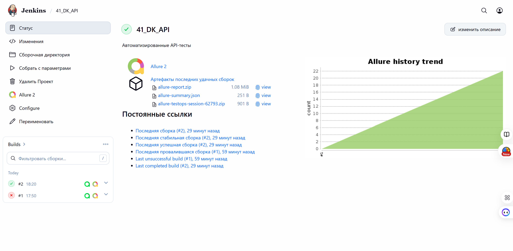
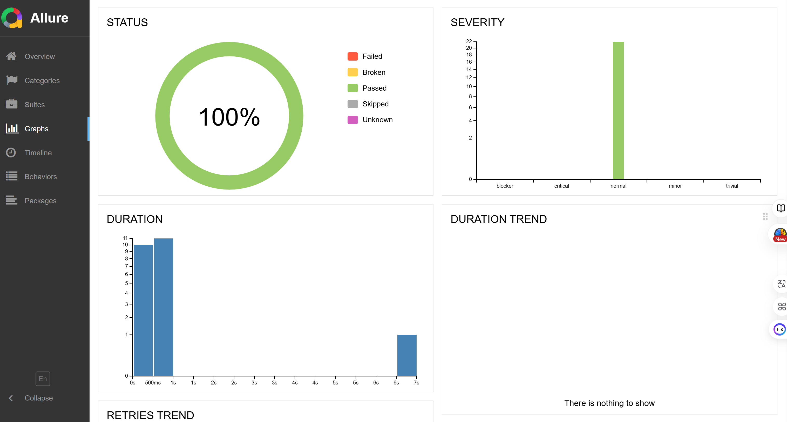
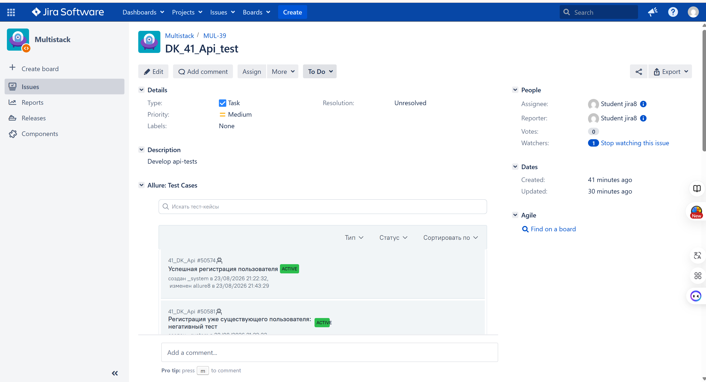

<div align="center">
  <h1 style="color: #1BA8A8; font-size: 2.5em; margin-bottom: 5px;">
    📚 Book Club
  </h1>
  <h3 style="color: #333333; font-weight: normal; margin-top: 0;">
    Дипломный проект по автоматизации тестирования: API <br>
    <a href="https://book-club.qa.guru" target="_blank" style="color: #1BA8A8; text-decoration: none; font-weight: bold;">
      book-club.qa.guru ↗
    </a>
  </h3>
</div>

## <span style="color: #1BA8A8;">✅</span> Содержание

- Технологии и инструменты
- Список проверок, реализованных в тестах
- Запуск тестов (сборка в Jenkins) / терминал
- Allure-отчет
- Интеграция с Allure TestOps
- Интеграция с Atlassian Jira
- Уведомление в Telegram о результатах прогона тестов

<a id="tools"></a>
## <span style="color: #1BA8A8;">✅</span> Технологии и инструменты

| Java                                                                                                      | IntelliJ  <br>  Idea                                                                                               | GitHub                                                                                                     | JUnit 5                                                                                                           | Gradle                                                                                                     | Selenide                                                                                                         | Selenoid                                                                                                                  | Allure <br> Report                                                                                                         |  Jenkins                                                                                                        |   Jira                                                                                                              | Telegram                                                                                                            |Allure <br> TestOps                                                                                                          
|:----------------------------------------------------------------------------------------------------------|--------------------------------------------------------------------------------------------------------------------|------------------------------------------------------------------------------------------------------------|-------------------------------------------------------------------------------------------------------------------|------------------------------------------------------------------------------------------------------------|------------------------------------------------------------------------------------------------------------------|---------------------------------------------------------------------------------------------------------------------------|----------------------------------------------------------------------------------------------------------------------------|-----------------------------------------------------------------------------------------------------------------|---------------------------------------------------------------------------------------------------------------------|---------------------------------------------------------------------------------------------------------------------|----------------------------------------------------------------------------------------------------------------------------------:|
| <a href="https://www.java.com/"></a>  | <a href="https://www.jetbrains.com/idea/"></a> | <a href="https://github.com/"></a> | <a href="https://junit.org/junit5/"></a> | <a href="https://gradle.org/"></a> | <a href="https://selenide.org/"></a> | <a href="https://aerokube.com/selenoid/"></a> | <a href="https://github.com/allure-framework"></a> |<a href="https://www.jenkins.io/"></a> | <a href="https://www.atlassian.com/software/jira/"></a> | <a href="https://web.telegram.org/"></a> |<a href="https://qameta.io/"></a> |

<a id="cases"></a>
## <span style="color: #1BA8A8;">✅</span> Реализованные API-проверки

- Успешная регистрация нового пользователя и авторизация с получением JWT-токенов
- Негативные сценарии авторизации: пустые поля, некорректный логин, существующий пользователь, неверный пароль, ошибочный Content-Type
- Успешный выход из системы (logout) с аннулированием refresh-токена
- Успешное обновление access-токена с помощью валидного refresh-токена
- Негативные сценарии работы с токенами: отсутствие токена, невалидный токен, передача access-токена вместо refresh, повторное использование отозванного токена
- Полное (PUT) и частичное (PATCH) обновление профиля пользователя
- Валидация обязательных полей при попытке частичного обновления через метод PUT
- CRUD-операции: создание, чтение по ID, полное обновление и удаление


##  Сборка в [Jenkins](https://jenkins.qa.guru/job/41_DK_API/)

<p align="center">  
</a>  
</p>


## <span style="color: #1BA8A8;">✅</span> Конфигурация проекта

- **Базовый URL API:** `https://book-club.qa.guru/api/v1/` 
- **Фреймворк:** Rest Assured + JUnit 5
- **Отчетность:** Allure Report с автоматической генерацией после каждого прогона
- **CI/CD:** Jenkins

## <span style="color: #1BA8A8;">✅</span> Команда для запуска из терминала
```bash
./gradlew clean test 
```

## </a>  <a name="Allure"></a>Allure Report	</a>


## Основная страница отчёта

<p align="center">  
  
</p>  

## Сьюты

<p align="center">  
  
<p align="center">  
  

</p>

## Graphs

<p align="center">  
  
</p>


##  <a href="https://allure.qa.guru/project/5363/launches" target="_blank" style="color: #1BA8A8; text-decoration: none;">Интеграция с Allure TestOps ↗</a>

## Allure TestOps Запуски

<p align="center">  
  
</p>  

## Авто тест-кейсы

<p align="center">  
   
</p>

## </a> Интеграция с <a target="_blank" href="https://jira.qa.guru/browse/MUL-39">Jira</a>

<p align="center">  
  
</p>

____

